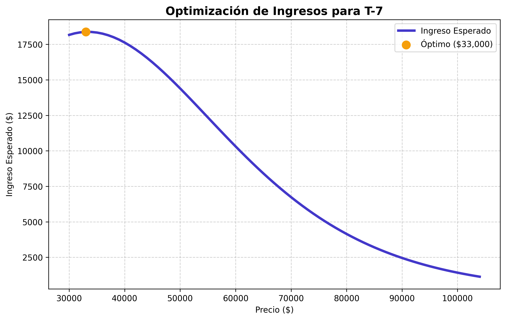
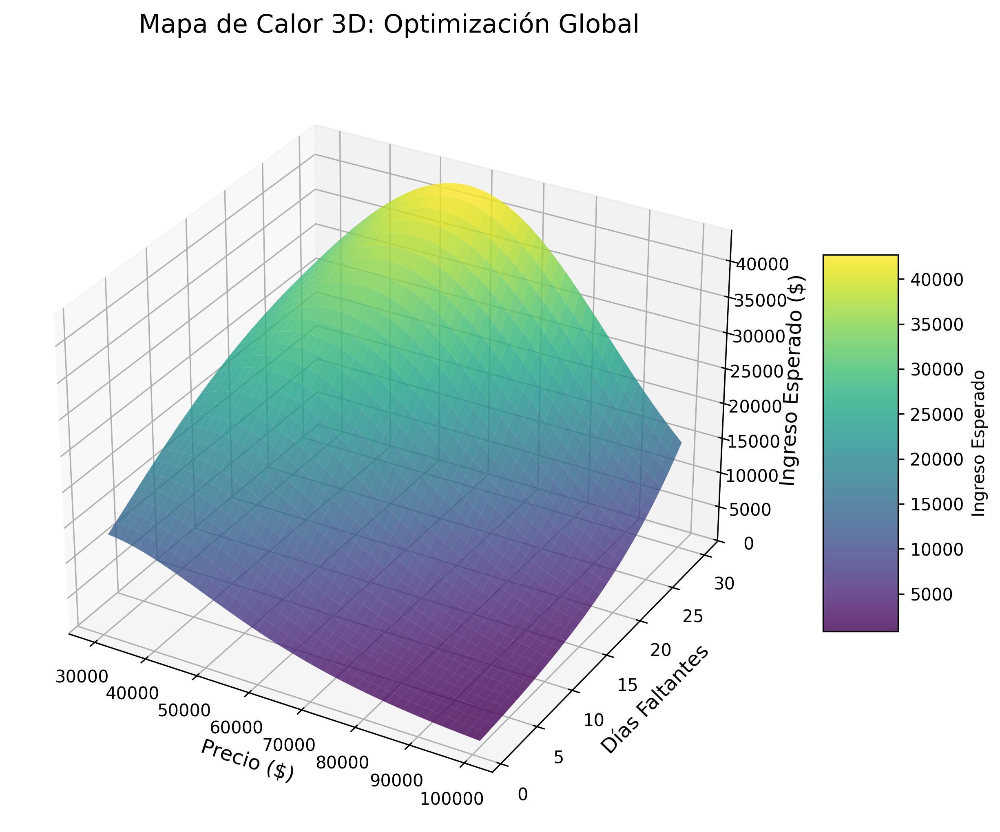
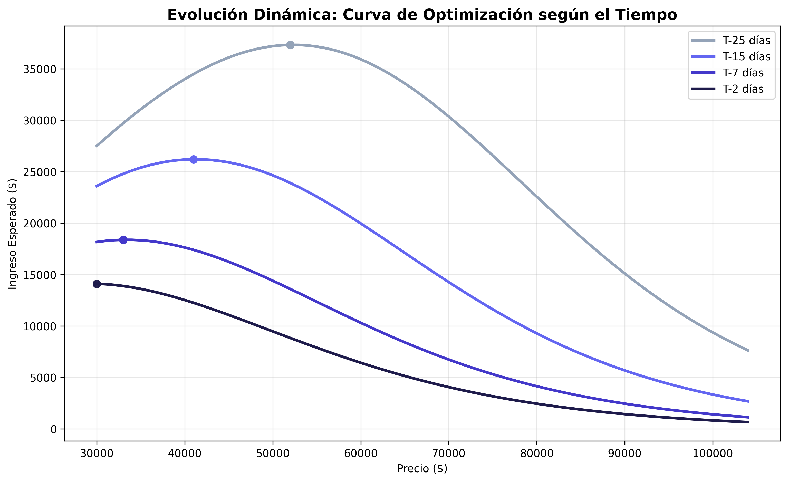

# 📈 Motor de Optimización de Precios Dinámicos
### (Dynamic Pricing Optimization Engine)

Este proyecto implementa un sistema de **Machine Learning** avanzado que utiliza **Regresión Logística** para maximizar los ingresos mediante la optimización de precios basada en la probabilidad de venta.

## 🚀 Impacto Visual (Wow Factor)

### 1. Optimización Estándar (T-7)
Identificación del precio que maximiza la **Esperanza Matemática** del ingreso en una fecha específica.



### 2. Mapa de Calor 3D (Optimización Global)
Una vista tridimensional que muestra cómo interactúan el **Precio** y los **Días Restantes** para generar el máximo ingreso. Esto demuestra la profundidad del modelo matemático.



### 3. Evolución Dinámica del Precio
Comparativa de cómo la curva de optimización se desplaza conforme se acerca el "Deadline". El motor ajusta la estrategia automáticamente.



## 🧠 Enfoque Matemático y de Negocio
Como matemático, diseñé este sistema para encontrar el punto de equilibrio óptimo. No se trata solo de predecir si se vende o no, sino de calcular:
$$E[I] = P \times P(\text{venta} | \text{Precio}, \text{Días})$$

Donde el precio sugerido es aquel que maximiza esta función.

## 📊 Validación del Modelo
El motor incluye métricas de desempeño profesionales que garantizan su fiabilidad:
- **Accuracy:** ~85%
- **ROC AUC Score:** ~0.94 (Excelente capacidad predictiva)

## 🛠️ Requisitos e Instalación
1. Clona el repositorio.
2. Instala las dependencias:
   ```bash
   pip install -r requirements.txt
   ```
3. Ejecuta el optimizador:
   ```bash
   python pricing_optimizer.py
   ```

## 📂 Estructura del Proyecto
- `pricing_optimizer.py`: Motor principal (Clase `PricingEngine`).
- `visualizer.py`: Módulo de generación de gráficas premium.
- `HISTORIAL_PROYECTO.md`: Registro detallado de la evolución del desarrollo.